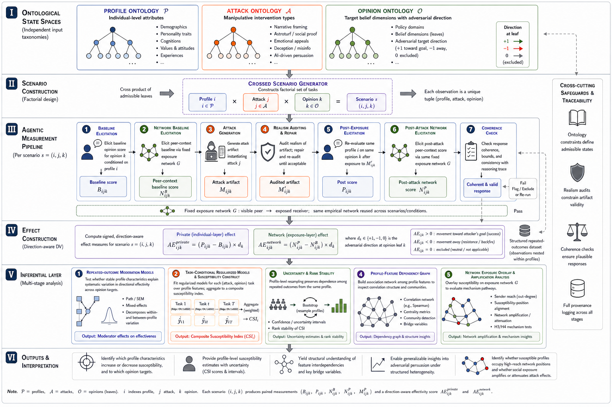

<div align="center">

# Inter-individual Differences in Susceptibility to Cyber-manipulation of Political Opinions

### An Ontology-Based Multi-Agent Simulation Approach

[](LICENSE)
[](https://www.python.org/)
[](docker/)

**Stijn Van Severen<sup>1,*</sup> · Thomas De Schryver<sup>1</sup> · Mira Ostyn<sup>1</sup>**

<sup>1</sup> Ghent University · <sup>*</sup> Corresponding author

---

</div>

## 📋 Table of Contents

- [🧬 Abstract](#abstract)
- [📄 Research Report](#research-report)
- [🔄 Pipeline](#pipeline)
- [🔬 Pipeline Runs](#pipeline-runs)
- [🗂️ Repository Structure](#repository-structure)
- [⚙️ Setup](#setup)
- [🚀 Manual Run](#manual-run)
- [📚 Citation](#citation)
- [⚖️ License](#license)

---

<a id="abstract"></a>
## 🧬 Abstract

This repository contains the backend research pipeline, the production-run artifacts, and the compiled paper for a study on how **inter-individual differences moderate susceptibility to cyber-manipulation of political opinions**.

The workflow represents `PROFILE`, `ATTACK`, and `OPINION` as explicit hierarchical ontologies, samples ontology-based profile by attack by opinion scenarios, elicits private and network-conditioned opinions with structured LLM agents, audits response coherence, computes directional adversarial effectivity, and estimates moderation and network amplification with scenario-level machine-learning and statistical diagnostics.

---

<a id="research-report"></a>
## 📄 Research Report

The full write-up, covering the methods, the results for both the individual and exposure-network layers, and the supplementary materials, is compiled to [`report/report/main.pdf`](report/report/main.pdf). The LaTeX source, figures, and tables live under [`report/`](report).

---

<a id="pipeline"></a>
## 🔄 Pipeline

The full workflow runs from ontology-based scenario construction through agentic measurement, direction-aware effect construction, and inferential analysis, across an individual (private) layer and an empirical exposure-network layer.

<div align="center">

</div>

**I. Ontological State Spaces.** Three independent input taxonomies define the admissible state space: `PROFILE` (individual-level attributes), `ATTACK` (manipulative intervention types), and `OPINION` (target belief dimensions, each leaf carrying an adversarial direction: `+1` toward the goal, `-1` away, `0` excluded).

**II. Scenario Construction.** A crossed scenario generator combines admissible leaves, so each observation is a unique tuple `(profile i, attack j, opinion k)`.

**III. Agentic Measurement Pipeline.** Per scenario, schema-constrained LLM agents (1) elicit a private baseline opinion, (2) elicit a network baseline after peer-context exposure on the fixed empirical graph, (3) generate an attack artifact, (4) audit and repair its realism, (5) re-elicit the private opinion after exposure, (6) re-elicit the opinion after post-attack peer exposure, and (7) check coherence, bounds, and consistency, flagging or re-running on failure. This produces the four states `B`, `N^B`, `P`, and `N^P`.

**IV. Effect Construction.** Compute the signed, direction-aware effectivity for both layers: the private effect `AE_private = (P − B) × d` and the network effect `AE_network = (N^P − N^B) × d`, where `d ∈ {+1, −1, 0}` is the adversarial direction at opinion leaf `k`. Positive values mean movement toward the attacker's goal, negative values resistance or backfire, and zero is excluded. The result is a structured repeated-outcome dataset (observations nested within profiles).

**V. Inferential Layer.** A multi-stage analysis: (1) repeated-outcome moderation models (path/SEM, mixed-effects, multilevel variance decomposition); (2) task-conditional regularized models (ridge / elastic net / LASSO per attack-by-opinion task) aggregated into a composite susceptibility index `CSI`; (3) uncertainty and rank stability via profile-cluster bootstrap; (4) a profile-feature dependency graph (signed correlation network, centrality, community detection, bridge variables); (5) a network-exposure overlay that maps susceptibility onto the exposure graph to test amplification and attenuation by sender position.

**VI. Outputs & Interpretation.** Identify which profile characteristics raise or lower susceptibility and toward which opinions, provide profile-level susceptibility estimates with uncertainty (`CSI` scores and intervals), surface feature interdependencies and bridge variables, and establish whether susceptible profiles in high-reach network positions amplify or attenuate attack effects.

Cross-cutting **safeguards and traceability** run across all stages: ontology constraints define admissible states, realism audits constrain artifact validity, coherence checks ensure plausible responses, and full provenance logging is kept end to end.

---

<a id="test-runs"></a>
<a id="pipeline-runs"></a>
## 🔬 Pipeline Runs

The evaluation record has two tiers: small **test runs** that validate methodology
end to end, and the full-scale **production run**. Each has its own README with the
complete configuration and headline results.

### Test Runs

Five test runs validate the pipeline and the exposure-network layer at small scale.

| Run | Design | Layers | Output |
|-----|--------|--------|--------|
| **Run 1** | 60 pseudoprofiles, 4 attack vectors, 3 opinions (crossed factorial, test ontology) | individual | [`evaluation/tests/run_1`](evaluation/tests/run_1) · [README](evaluation/tests/run_1/README.md) |
| **Run 2** | 100 scenarios from the 10,000-row integrated production set (full profiles, DISARM Plan/Prepare/Execute triplets, opinion clusters) | individual + exposure-network | [`evaluation/tests/run_2`](evaluation/tests/run_2) · [README](evaluation/tests/run_2/README.md) |
| **Run 3** | the run-2 production design on the current cluster pipeline + the integrated empirical exposure-network layer | individual + exposure-network (cluster) | [`evaluation/tests/run_3`](evaluation/tests/run_3) · [README](evaluation/tests/run_3/README.md) |
| **Run 4** | 200 scenarios concentrated into 2 issue domains so the empirical exposure network is dense, on a recalibrated exposure-network layer | individual + exposure-network (working) | [`evaluation/tests/run_4`](evaluation/tests/run_4) · [README](evaluation/tests/run_4/README.md) |
| **Run 5** | 60 scenarios in a single issue domain with a reduced (about 40 percent smaller) profile and per-attack-tactic conditional estimation, so the individual-layer moderators are interpretable | individual + exposure-network | [`evaluation/tests/run_5`](evaluation/tests/run_5) · [README](evaluation/tests/run_5/README.md) |

**Run 5 is the test reference.** It keeps the run-4 four-state backbone (`B`, `BN`, `P`, `PN`) and working exposure-network methodology, and fixes the individual layer with a reduced research-core profile (dropping the redundant HEXACO/Eysenck/Hexad personality taxonomies and the low-relevance subtrees that left earlier moderator models under-determined). With the reduced profile the moderation is interpretable (openness a significant moderator, b = +2.78, p = 0.030), and the conditional-susceptibility estimator carries per-DISARM-Execute-tactic tasks so a specific attack vector can be selected in the dashboard. Reproduce with `bash scripts/tests/run_5.sh` (`--no-network` for the individual layer only, `--verbose` for a live monitor).

### Production Runs

| Run | Design | Layers | Output |
|-----|--------|--------|--------|
| **Run 1** | all 10,000 integrated scenarios (stratified across the 7 issue domains, 151,448 opinion-leaf measurements); a 159-feature research-core profile (full hierarchical Big Five, core demographics, and the political-psychology / ideology / moral-foundations battery) | individual only | [`evaluation/production/run_1`](evaluation/production/run_1) · [README](evaluation/production/run_1/README.md) |
| **Run 2** | a fixed full-factorial panel of 100 profiles × 7 opinions × 5 social-media attacks (3,500 scenarios) on the empirical `politisky24_bluesky_v1` graph; four-state `B`/`N^B`/`P`/`N^P` backbone plus a counterfactual alignment-gradient branch | exposure-network | [`evaluation/production/run_2`](evaluation/production/run_2) · [README](evaluation/production/run_2/README.md) |

**Production run 1 is the full-scale individual-layer measurement.** It runs stages 01 to 05 over the entire integrated set (about 20,000 LLM calls on `deepseek/deepseek-v4-flash`), with the exposure-network layer off, on a deep research-core profile (~159 features). Storage is lean: stage 05 keeps only the compact CSV delta tables, and any scenario's full source is recoverable by joining the integrated set on `scenario_id`. Headline results: the attack reliably moves private opinions (88 percent of leaves, Cohen d_z = 1.23); what is attacked dominates who is attacked (the issue domain explains roughly 30 times more between-scenario variance than the entire 159-trait profile battery, and the specific DISARM tactic barely matters); and susceptibility is highly heterogeneous between individuals (ICC = 0.83) but only weakly trait-aligned, with the Big Five the leading moderator family (openness and neuroticism more movable, conscientiousness more resistant, all FDR-significant). Reproduce with:

```bash
bash scripts/production/run_1.sh --verbose            # the 10,000-scenario run (stages 01..05)
.venv/bin/python src/backend/utils/analysis/analyze_run_1.py  # moderation, inferential tests, figures
```

**Production run 2 is the full-scale exposure-network measurement.** On a fixed full-factorial panel (100 deterministic profiles × 7 opinions × 5 social-media attacks = 3,500 scenarios) embedded in the empirical `politisky24_bluesky_v1` graph, it adds the four-state backbone (`B`, `N^B`, `P`, `N^P`) and a counterfactual alignment-gradient branch over 35 opinion-by-attack conditions. Headline results: network-conditioned susceptibility is related to but not reducible to private susceptibility (r = .28; the direct effect is not significant once traits are modelled jointly), and an attack's network-wide effect increases substantially when comparatively susceptible profiles occupy higher-reach sender positions (condition-level alignment slope β = 2.40, p < .001). Reproduce with `bash scripts/production/run_2.sh full`.

Both launchers check for `OPENROUTER_API_KEY` and verify the projected OpenRouter budget before running.

---

<a id="repository-structure"></a>
## 🗂️ Repository Structure

```text
research_paper_on_cybermanipulation_susceptibility/
|-- README.md
|-- LICENSE
|-- CITATION.cff
|-- requirements.txt
|-- .env.example
|-- .gitignore
|-- docker/                        (Dockerfile, docker-compose.yml, entrypoint.sh)
|-- report/                        (compiled paper: report/main.tex + main.pdf; assets/figures + assets/tables)
|-- scripts/
|   |-- tests/                     (run_1.sh, run_2.sh, run_3.sh, run_4.sh, run_5.sh)
|   `-- production/                (run_1.sh: individual layer; run_2.sh: exposure-network layer)
|-- evaluation/
|   |-- tests/
|   |   |-- run_1/                 (individual layer; see run_1/README.md)
|   |   |-- run_2/                 (individual + exposure-network; see run_2/README.md)
|   |   |-- run_3/                 (prior integrated reference; see run_3/README.md)
|   |   |-- run_4/                 (dense 2-domain exposure-network reference; see run_4/README.md)
|   |   `-- run_5/                 (test reference, reduced profile; see run_5/README.md)
|   |       |-- config/            (run configuration)
|   |       |-- logs/              (per-stage logs)
|   |       |-- provenance/        (raw LLM calls + run manifest)
|   |       |-- stage_outputs/     (canonical per-stage data for post-hoc analysis, all B/BN/P/PN phases)
|   |       |-- analysis/          (datasets, SEM, moderation report)
|   |       |-- visuals/           (dashboard, figures, embeddings, network_exposure_analysis)
|   |       |-- publication/       (publication assets + paper)
|   |       `-- README.md
|   `-- production/
|       |-- run_1/                 (full 10,000-scenario individual-layer run; see run_1/README.md)
|       |   |-- config/            (run configuration)
|       |   |-- logs/              (console log)
|       |   |-- stage_outputs/     (stages 01..05: scenarios, baseline B, attack spec, post-attack P, effectivity deltas)
|       |   `-- README.md
|       `-- run_2/                 (exposure-network run: 3,500-scenario panel; see run_2/README.md)
|           |-- config/            (scenario design, attack/opinion panels, ontology snapshot)
|           |-- stage_outputs/     (stages 01..08b: four-state B/N^B/P/N^P backbone, deltas, SEM)
|           |-- network_exposure_analysis/   (figures, tables, validation reports)
|           |-- counterfactual_alignment_gradient/  (H6/H7 alignment-gradient branch)
|           `-- README.md
`-- src/
    |-- data/                      (empirical exposure-network substrate)
    `-- backend/
        |-- agentic_framework/     (agents, factory, prompts 01-04 + opinion_coherence_review)
        |-- ontology/
        |-- pipeline/
        |   |-- separate/          (numbered stages 01..08 plus the network stages 01b/02b/04b/05b)
        |   `-- full/              (run_full_pipeline orchestrator)
        `-- utils/                 (core: io, schemas, ontology_utils, logging; grouped: figures/, reporting/, analysis/, scenario/, embeddings/, network_exposure/)
```

The compiled paper and its assets live in `report/` (LaTeX source, figures, tables, and `main.pdf`). Local virtual environments, editor files, local frontends, and `.env` files are intentionally excluded from the repository.

---

<a id="setup"></a>
## ⚙️ Setup

### 🐍 Local (virtualenv)

```bash
git clone https://github.com/stvsever/research_paper_on_cybermanipulation_susceptibility.git
cd research_paper_on_cybermanipulation_susceptibility
python3.12 -m venv .venv
source .venv/bin/activate
pip install --upgrade pip
pip install -r requirements.txt
cp .env.example .env
```

Add `OPENROUTER_API_KEY` to `.env` before running the pipeline.

### 🐳 Docker

A reproducible container (Python 3.11 plus Tectonic for report builds) is defined under [`docker/`](docker/). Build the image and run a small end-to-end test pipeline with:

```bash
cp .env.example .env          # then add OPENROUTER_API_KEY
docker compose -f docker/docker-compose.yml up --build
```

Outputs are written to the mounted `evaluation/` and `report/` directories. The run is configured through environment variables (for example `OUTPUT_ROOT`, `RUN_ID`, `N_PROFILES`, `OPENROUTER_MODEL`, `BUILD_REPORT`); set `BUILD_REPORT=true` to compile the paper inside the container.

---

<a id="manual-run"></a>
## 🚀 Manual Run

The launcher `scripts/production/run_1.sh` is the recommended entry point. The equivalent direct invocation for the full individual-layer production run (run 1, network layer off) is:

```bash
.venv/bin/python src/backend/pipeline/full/run_full_pipeline.py \
  --output-root evaluation/production/run_1 \
  --run-id production_run_1 \
  --integrated-scenarios-path src/backend/pipeline/separate/01_create_scenarios/samples/02_integrated/integrated_scenarios_10000.jsonl \
  --n-scenarios 10000 \
  --no-max-entropy-subsample \
  --seed 1001 \
  --attack-ratio 1.0 \
  --no-use-test-ontology \
  --ontology-root src/backend/ontology/separate/production \
  --no-enforce-compatibility-rules \
  --drop-direction-neutral-opinions \
  --no-with-network-exposure \
  --openrouter-model deepseek/deepseek-v4-flash \
  --temperature 0.15 \
  --max-repair-iter 1 \
  --profile-generation-mode deterministic \
  --no-self-supervise-opinion-coherence \
  --no-self-supervise-attack-realism \
  --lean-storage \
  --resume-from-stage 01 \
  --stop-after-stage 05
```

Add `--with-network-exposure --exposure-network-root src/data/exposure_networks/politisky24_bluesky_v1` to enable the exposure-network layer; the full network production run is reproduced with `bash scripts/production/run_2.sh full`. The small test runs are reproduced with `bash scripts/tests/run_1.sh` through `run_5.sh`.

---

<a id="citation"></a>
## 📚 Citation

### APA 7

> Van Severen, S., De Schryver, T., & Ostyn, M. (2026). *Inter-individual Differences in Susceptibility to Cyber-manipulation of Political Opinions: An Ontology-Based Multi-Agent Simulation Approach*. Ghent University. https://github.com/stvsever/research_paper_on_cybermanipulation_susceptibility

### BibTeX

```bibtex
@article{vanseveren2026cybermanipulationsusceptibility,
  title     = {Inter-individual Differences in Susceptibility to Cyber-manipulation of Political Opinions: An Ontology-Based Multi-Agent Simulation Approach},
  author    = {Van Severen, Stijn and De Schryver, Thomas and Ostyn, Mira},
  year      = {2026},
  institution = {Ghent University},
  url       = {https://github.com/stvsever/research_paper_on_cybermanipulation_susceptibility}
}
```

A machine-readable citation is also available in [`CITATION.cff`](CITATION.cff).

---

<a id="license"></a>
## ⚖️ License

This project is licensed under the **MIT License**; see the [LICENSE](LICENSE) file for details.

---

<div align="center">

Built at **Ghent University** for the course *Case Studies in the Analysis of Experimental Data*

</div>
