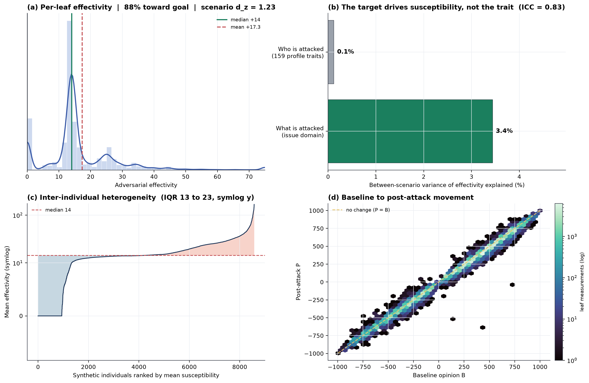
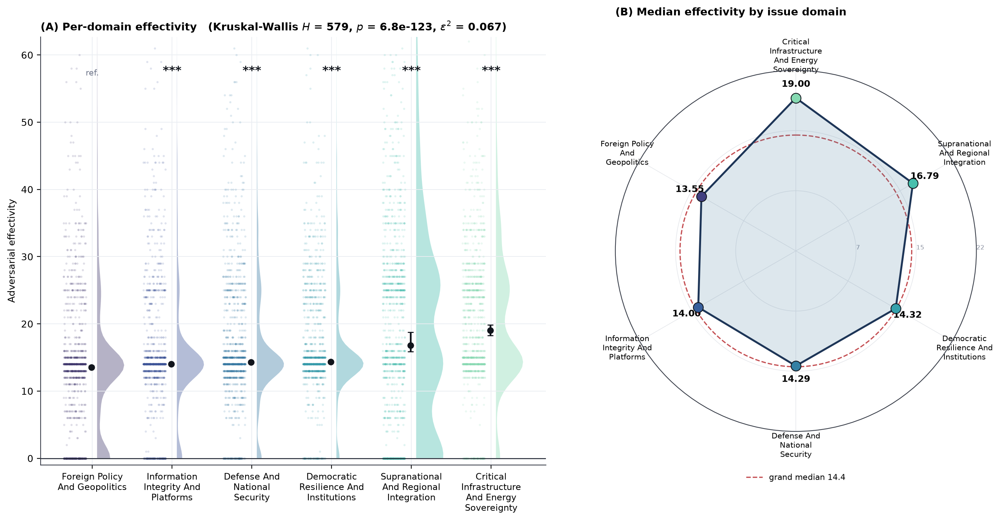
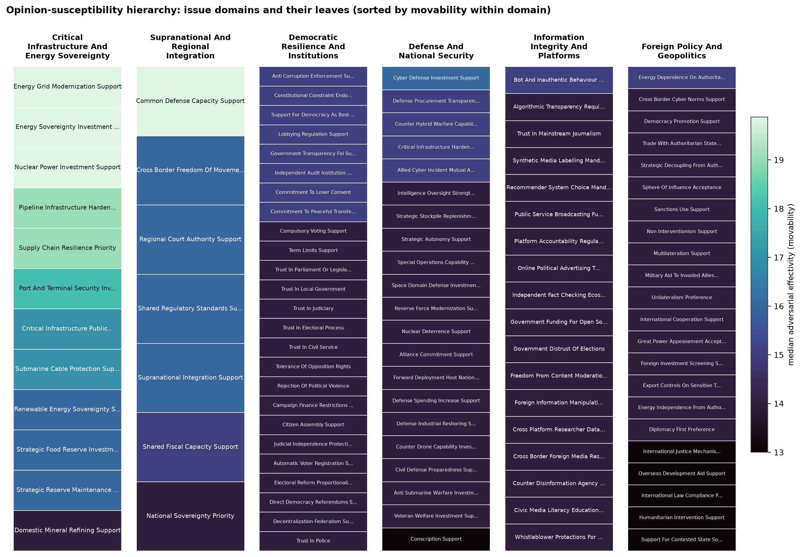
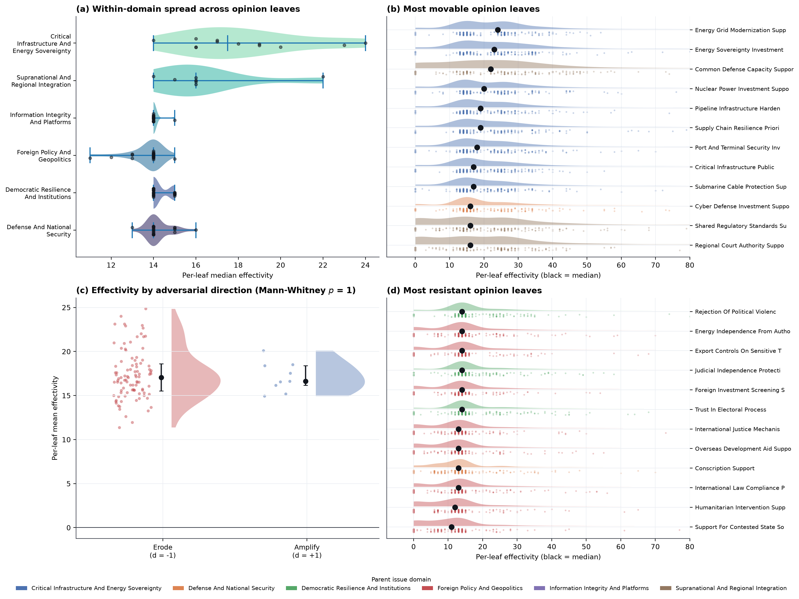
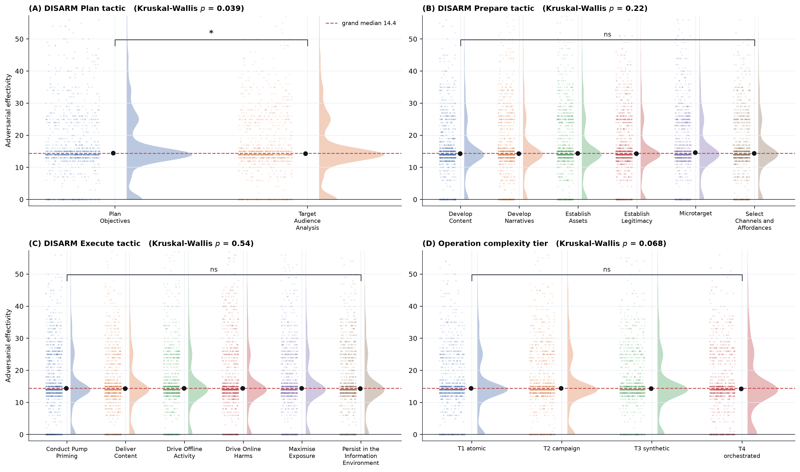
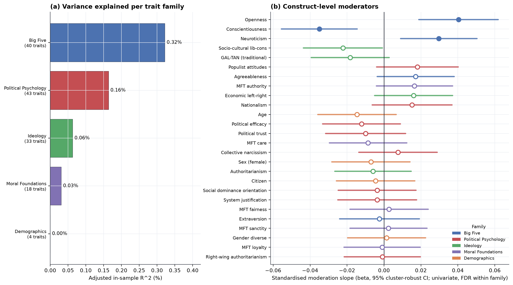
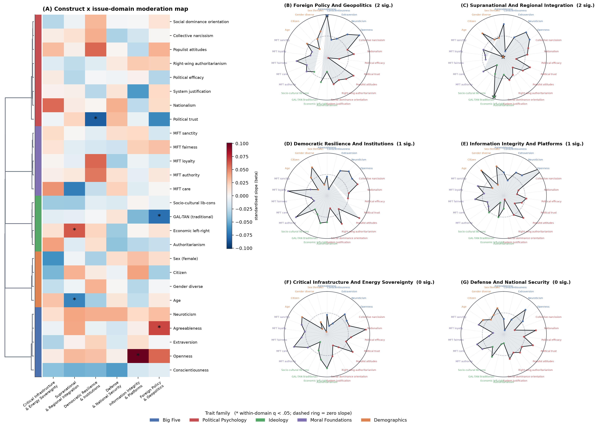

# Production Run 1: Individual-layer susceptibility at full scale (10,000 scenarios)

This is the production run of the individual (private) susceptibility layer over the
ENTIRE 10,000-row integrated scenario set, launched with
`bash scripts/production/run_1.sh`. The empirical exposure-network layer is OFF, so
the whole LLM budget goes to the individual layer. Stages 01 to 05 produce every
private baseline (B), post-attack (P) and effectivity delta per scenario and leaf;
the analyses and figures below are computed from those saved scores with
`src/backend/utils/analysis/analyze_run_1.py`.

## Design

| Component | Value |
|-----------|-------|
| Scenarios | all 10,000 rows of the integrated set, stratified across the 7 issue domains (about 1,429 each); 151,448 opinion-leaf measurements |
| Domains | 7 opinion parent clusters and 106 directional opinion leaves; the single-leaf "Macroeconomic and Fiscal Policy" domain is a statistical outlier and is excluded from every analysis and figure, leaving 6 domains and 8,572 analysis scenarios |
| Profile | the profile is reduced a second time, from 336 to about 159 features (a 53 percent further reduction, 71 percent versus the full 540-feature integrated profile), keeping the full hierarchical Big Five, the core demographic markers and the political-psychology / ideology / moral-foundations battery, and dropping the political-participation, socioeconomic and life-circumstance taxonomies and the over-detailed identity spectra |
| Stages | 01 to 05 (scenario build, baseline B, attack spec, post-attack P, effectivity deltas) |
| Layers | individual only (no network) |
| Model | `deepseek/deepseek-v4-flash` through OpenRouter; about 20,000 calls (2 fallbacks) |
| Outcome | `adversarial_effectivity = (P - B) * d`, positive meaning the opinion moved toward the attacker goal |

## What is measured and saved

Per opinion-cluster leaf: the private baseline B (stage 02) and post-attack P
(stage 04), with `d` the per-leaf adversarial direction. Storage is lean: stage 05
keeps only the compact CSV delta tables (`stage_outputs/05_compute_effectivity_deltas/sem_long_raw.csv`
carries every B, P, delta and effectivity score per scenario and leaf); raw LLM
provenance and the large JSONL mirrors are not retained. The full source content of
any scenario is recoverable by joining the integrated set on `scenario_id`. The
identity `adversarial_effectivity = (post_score - baseline_score) * adversarial_direction`
holds exactly on all 151,448 rows.

## Results

The unit of analysis is the scenario (one synthetic person and one attack); the ~15
opinion-leaf measurements within a scenario are averaged before any profile
regression, so each of the 8,572 analysis scenarios is one independent observation.
Group differences use rank-based tests with Benjamini-Hochberg FDR correction applied
within each family of comparisons; profile moderators are corrected within each
profile family; figure intervals are scenario-clustered bootstraps and the primary
summary is the median.

### The attack works, and the target matters far more than the trait



**Note.** Across the opinion measurements the attack moved the private opinion toward
the attacker goal in 88 percent of leaves (panel a; median shift in teal, mean in
red), with a strongly direction-consistent movement (panel d sits on the
attacker-intended side of the no-change diagonal). Panel (b) is the central result of
the individual layer: the issue domain that is attacked explains 3.4 percent of the
between-scenario variance in mean effectivity, whereas all 159 profile traits together
explain only 0.1 percent out-of-sample, about a 30-fold gap. Susceptibility is
nonetheless strongly heterogeneous between individuals (leaf-level between-profile
ICC = 0.83; between-person SD = 14.7, panel c, permutation p = 0.001); people differ a
great deal in how movable they are, but that heterogeneity is largely not captured by
standard trait inventories. The overall attack effect is large on independent scenario
means (Wilcoxon p < 1e-300, Cohen d_z = 1.23).

### Which opinions are most manipulable



**Note.** Per-domain effectivity as rainclouds (half-violin density, raw scenario
points, and the scenario-clustered median with a 95 percent CI), with the classic
significance brackets on adjacent domains (Mann-Whitney, BH-FDR: * q<.05, ** q<.01,
*** q<.001). Critical-infrastructure, supranational-integration and
information-integrity opinions are the most movable, defence and democratic-resilience
the least (Kruskal-Wallis H = 579, p = 6.8e-123, epsilon^2 = 0.067).



**Note.** The issue domains and their leaves, sorted by movability within each domain
and coloured by median effectivity, so the whole opinion ontology and the most
manipulable specific items are visible at once.



**Note.** The opinion-cluster hierarchy in four views: (a) the issue domain by DISARM
Execute-tactic median-effectivity matrix with the domains ordered by clustering, (b)
the domain by operation-complexity-tier matrix, (c) the within-domain spread of
per-leaf median effectivity (each domain contains both highly movable and resistant
leaves), and (d) the most movable opinion leaves coloured by their parent domain.
Movability is largely a property of the opinion and its parent domain rather than of
the specific Execute tactic (the columns in panel a are similar within a row).

### Attack-component diagnostics



**Note.** Effectivity across the DISARM operation hierarchy (Plan, Prepare and Execute
tactics, and the complexity tier) as rainclouds with adjacent-pair significance
brackets and the Kruskal omnibus per panel. Only the Plan tactic shows a difference
(planning around target-audience analysis versus objectives, p = 0.039); the Prepare
and Execute tactics and the operation-complexity tier do not differ significantly. The
manipulation is broadly effective regardless of the specific operational variant,
consistent with the target, not the tactic, being decisive.

### Profile moderation: which inter-individual differences matter



**Note.** Each profile family is analysed on its own footing. Panel (a) is the
variance of susceptibility each family explains (adjusted in-sample R^2, so it is
non-negative): the **Big Five personality family carries the most signal** (0.32
percent), then political psychology, ideology, moral foundations and demographics.
Panel (b) is the construct-level moderator forest (one interpretable score per
construct, univariate standardised slopes with 95 percent cluster-robust CIs, FDR
within family, filled markers q < 0.05). Three Big Five traits are the significant
moderators: **openness to experience** (beta = +0.040, more open is more movable),
**conscientiousness** (beta = -0.035, more conscientious is more resistant) and
**neuroticism** (beta = +0.030, more neurotic is more movable). At the finer
facet level 24 traits are significant (FDR within family), while only the three Big
Five constructs survive the strict cross-family model. The absolute effects are
deliberately reported as modest: susceptibility is conditional and heterogeneous, so
standard trait axes capture only a small, though real and sensible, part of who is
movable, and general personality predicts it better than specific political attitudes.



**Note.** The same moderators re-estimated within each domain (rows clustered by their
cross-domain profile; * marks within-domain BH-FDR q < 0.05). The clearest
domain-specific effect is openness in the information-integrity domain. Most
domain-specific slopes are directional but modest, as expected when moderation is
conditional and heterogeneous.

### Interactive dashboard

`visuals/production_dashboard.html` is the full self-contained interactive dashboard
(the pipeline's `generate_research_visuals`, about 40 plots across many tabs): the
ontology explorer (the opinion and DISARM attack ontologies as interactive trees and
sunbursts), the modular profile-trait network, the conditional-susceptibility index
and per-attack-tactic views, the moderation and SEM panels, and the per-leaf and
per-domain effectivity views. It is generated from the stage-05 deltas via a stage-06
pass on a no-macro subsample (`src/backend/utils/analysis/build_dashboard.py`); the page itself
is portable and needs no server.

## Headline

1. The simulated attack reliably moves private political opinions (Cohen d_z = 1.23).
2. What is attacked dominates who is attacked: the issue domain explains roughly 30
   times more between-scenario variance than the entire 159-trait profile battery, and
   the specific DISARM tactic barely matters.
3. Susceptibility is highly heterogeneous between individuals (ICC = 0.83) but only
   weakly along measured trait axes; the Big Five personality family is the leading
   moderator, with openness (more movable), conscientiousness (more resistant) and
   neuroticism (more movable) as the significant, sensible person-level moderators.

## Reproduce

```bash
bash scripts/production/run_1.sh --verbose        # the 10,000-scenario run (stages 01..05)
.venv/bin/python src/backend/utils/analysis/analyze_run_1.py   # analyses + figures from the saved deltas
```

Analysis tables are written to `analysis/` (family table, within-family and curated
moderators, by-domain moderators, inferential tests, variance context) and the figures
to `visuals/paper_figures/` plus the interactive `visuals/production_dashboard.html`.
