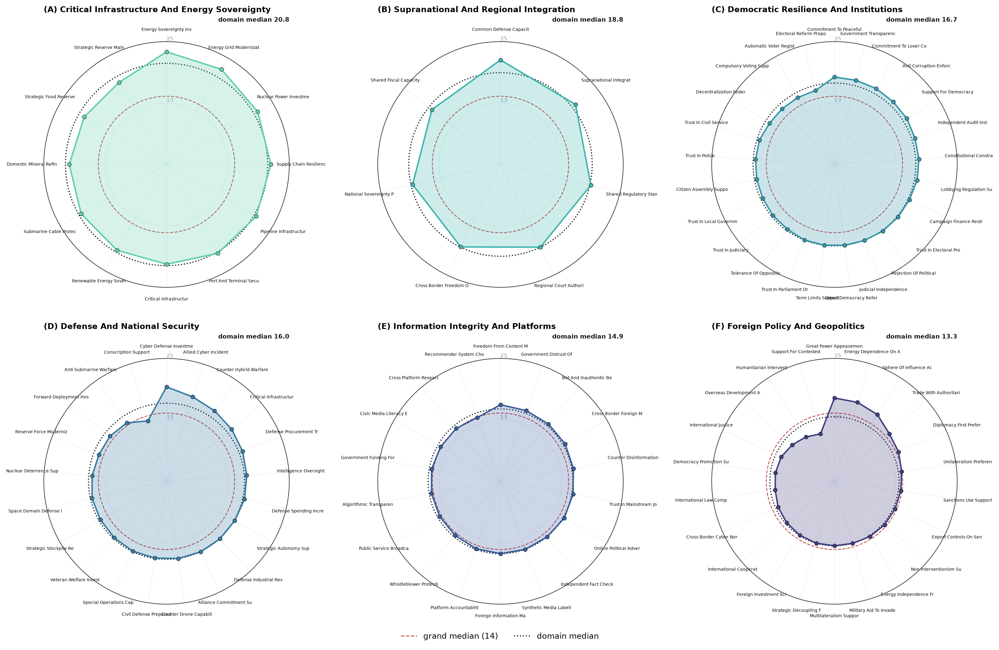

# Production Run 1: Individual-layer susceptibility at full scale (10,000 scenarios)

This is the production run of the individual (private) susceptibility layer over the
entire 10,000-row integrated scenario set, launched with `bash scripts/production/run_1.sh`.
The empirical exposure-network layer is off, so the full LLM budget goes to the individual
layer. Stages 01 to 05 produce every private baseline (B), post-attack (P), and effectivity
delta per scenario and leaf; the analyses and figures below are computed from those saved
scores with `src/backend/utils/analysis/analyze_run_1.py`.

## Design

| Component | Value |
|-----------|-------|
| Scenarios | all 10,000 rows of the integrated set, stratified across the 7 issue domains (about 1,429 each); 151,448 opinion-leaf measurements |
| Domains | 7 opinion parent clusters and 106 directional opinion leaves; the single-leaf "Macroeconomic and Fiscal Policy" domain is a statistical outlier and is excluded from every analysis and figure, leaving 6 domains and 8,572 analysis scenarios |
| Profile | reduced from 336 to about 159 features (a 53 percent further reduction, 71 percent versus the full 540-feature integrated profile), retaining the full hierarchical Big Five, core demographic markers, and the political-psychology, ideology, and moral-foundations battery; political-participation, socioeconomic and life-circumstance taxonomies, and over-detailed identity spectra are dropped |
| Stages | 01 to 05 (scenario build, baseline B, attack spec, post-attack P, effectivity deltas) |
| Layers | individual only (no network exposure) |
| Model | `deepseek/deepseek-v4-flash` through OpenRouter; about 20,000 calls (2 deterministic fallbacks) |
| Outcome | `adversarial_effectivity = (P - B) * d`, positive meaning the opinion moved toward the attacker goal |

## What is measured and saved

Per opinion-cluster leaf: the private baseline B (stage 02) and post-attack P (stage 04),
with `d` the per-leaf adversarial direction. Storage is lean: stage 05 keeps only the
compact CSV delta tables (`stage_outputs/05_compute_effectivity_deltas/sem_long_raw.csv`
carries every B, P, delta, and effectivity score per scenario and leaf); raw LLM provenance
and large JSONL mirrors are not retained. The full source content of any scenario is
recoverable by joining the integrated set on `scenario_id`. The identity
`adversarial_effectivity = (post_score - baseline_score) * adversarial_direction`
holds exactly on all 151,448 rows.

## Results

The unit of analysis is the scenario (one synthetic person and one attack); the roughly
fifteen opinion-leaf measurements within a scenario are averaged before any profile
regression, so each of the 8,572 analysis scenarios is one independent observation. Group
differences use rank-based tests with Benjamini-Hochberg FDR correction applied within each
family of comparisons; profile moderators are corrected within each profile family; figure
intervals are scenario-clustered bootstraps and the primary summary is the median.

### The attack works, and the target matters far more than the trait


**Note.** Across the 151,448 opinion-leaf measurements, the simulated attack moved the
private opinion toward the attacker goal in 88 percent of leaves (panel a; median shift in
teal, mean in red), with a strongly direction-consistent movement visible in panel d, where
the mass of the baseline-vs-post-attack density lies on the attacker-intended side of the
no-change diagonal. Panel b is the central variance-decomposition result: the issue domain
explains 3.4 percent of between-scenario variance in mean effectivity, whereas the entire
159-feature profile battery explains only 0.1 percent out-of-sample, a roughly thirty-fold
gap. Susceptibility is nonetheless strongly heterogeneous between individuals (leaf-level
between-profile ICC = 0.83; between-person SD approximately 14.7, panel c; permutation
p = 0.001): people differ substantially in how movable they are, but that heterogeneity is
largely not captured by standard trait inventories. The overall attack effect is large and
reliable on independent scenario means (Wilcoxon p < 1e-300, Cohen d_z = 1.23).

### Which opinions are most manipulable


**Note.** Per-domain effectivity as rainclouds (half-violin density, raw scenario points,
and the scenario-clustered median with a 95 percent bootstrap CI), ordered from most to
least movable. Critical-infrastructure and energy-sovereignty opinions are the most movable
(median AE = 19.0), followed by supranational and regional integration (16.8); the remaining
four domains cluster near 13.5 to 14.3, with foreign policy and geopolitics the least
movable (13.5). The omnibus Kruskal-Wallis test is highly significant (H = 579, p = 6.8e-123,
epsilon^2 = 0.067). The extreme contrast (critical infrastructure vs. foreign policy) reaches
a rank-biserial effect size of 0.46. Technocratic, instrumentally framed domains move most;
domains that anchor national identity and institutional integrity move least.



**Note.** One radar per issue domain: the domain's opinion leaves are the spokes and the
radius is each leaf's mean adversarial effectivity, so the movability fingerprint of each
domain's opinion set is readable at a glance. The dashed ring marks the grand median (+ 14)
and the radial scale is shared across panels. Critical-infrastructure and supranational-integration
domains have the widest profiles; information integrity and defence the tightest.


**Note.** The opinion-cluster hierarchy in four views: (a) the within-domain spread of
per-leaf median effectivity, showing that every domain contains both highly movable and
resistant leaves; (b) the most movable individual opinion leaves across all domains,
coloured by parent domain; (c) effectivity by adversarial direction (amplify vs. erode),
which shows no meaningful difference (Mann-Whitney p = 1), so there is no directional
asymmetry once the adversarial direction is encoded in the score; (d) the most resistant
leaves. Movability is largely a property of the opinion and its parent domain rather than
of the specific operative direction.

### Attack-component diagnostics


**Note.** Effectivity across the DISARM operation hierarchy (Plan, Prepare, and Execute
tactics, and the complexity tier) as rainclouds with the Kruskal-Wallis omnibus per panel.
Only the two-level Plan tactic shows a statistically detectable difference (planning around
objectives vs. target-audience analysis, p = 0.039, rank-biserial = 0.03); the Prepare and
Execute tactics and the operation-complexity tier do not differ significantly, and there is
no complexity dose-response (Spearman rho = -0.015, p = 0.16). The manipulation is broadly
effective regardless of the specific operational variant, consistent with the opinion target
rather than the tactic being the decisive factor.

### Profile moderation: which inter-individual differences matter


**Note.** Each profile family is analysed on its own footing. Panel (a) shows the adjusted
in-sample R^2 (variance of susceptibility explained) per family: the Big Five personality
family carries the most signal (0.32 percent, and the only positive cross-validated R^2 of
+0.0024), ahead of political psychology (0.16 percent), ideology (0.06 percent), moral
foundations (0.03 percent), and demographics (0.00 percent). Panel (b) is the construct-level
moderator forest (univariate standardised slopes with 95 percent scenario-clustered bootstrap
CIs, FDR-corrected within family, filled markers q < 0.05). Three Big Five constructs are
the significant moderators: openness to experience (beta = +0.042, more open is more movable),
conscientiousness (beta = -0.035, more conscientious is more resistant), and neuroticism
(beta = +0.030, more neurotic is more movable). At the finer facet level, 24 traits are
significant within their family. The political-psychology, ideology, moral-foundations, and
demographics families add little predictive signal beyond personality, consistent with the
pattern that general personality predicts susceptibility better than specific political
attitudes do.


**Note.** The same construct-level moderators re-estimated within each issue domain (rows
clustered by cross-domain profile; starred cells mark within-domain BH-FDR q < 0.05). The
clearest domain-specific effects are openness in the information-integrity domain (beta = +0.101,
q = 0.005) and political trust as a buffer in the democratic-resilience domain (beta = -0.083,
q = 0.020). Most domain-specific slopes are directional but modest, consistent with the
expectation that moderation is conditional on both who is attacked and what is attacked.

### Interactive dashboard

`visuals/production_dashboard.html` is the full self-contained interactive dashboard (the
pipeline's `generate_research_visuals`, about 40 panels across multiple tabs): the ontology
explorer (the opinion and DISARM attack ontologies as interactive trees and sunbursts), the
modular profile-trait network, the conditional-susceptibility index and per-attack-tactic
views, the moderation and SEM panels, and the per-leaf and per-domain effectivity views.
It is generated from the stage-05 deltas via a stage-06 pass on a no-macro subsample
(`src/backend/utils/analysis/build_dashboard.py`); the page is portable and needs no server.

## Headline

1. The simulated attack reliably moves private political opinions toward the adversarial goal
   in 89 percent of scenarios (median scenario shift +14.4 on the 2,001-position scale,
   Cohen d_z = 1.23, p < 1e-300).
2. What is attacked dominates who is attacked: the issue domain explains roughly 30 times more
   between-scenario variance than the entire 159-trait profile battery, and the specific DISARM
   tactic barely matters (Execute omnibus p = 0.54, no complexity dose-response).
3. Susceptibility is highly heterogeneous between individuals (leaf-level ICC = 0.83) but only
   weakly aligned with measured trait axes; the Big Five is the leading moderator family, with
   openness (more movable), conscientiousness (more resistant), and neuroticism (more movable)
   as the three FDR-significant person-level moderators.

## Reproduce

```bash
bash scripts/production/run_1.sh --verbose        # the 10,000-scenario run (stages 01..05)
.venv/bin/python src/backend/utils/analysis/analyze_run_1.py   # analyses + figures from the saved deltas
```

Analysis tables are written to `analysis/` (family table, within-family and curated
moderators, by-domain moderators, inferential tests, variance context) and the figures to
`visuals/paper_figures/` plus the interactive `visuals/production_dashboard.html`.
