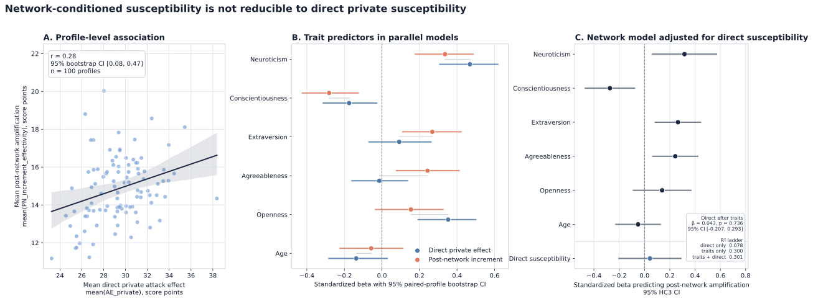

# Network Exposure Layer Methods and Results Draft

## Integration With The Individual-Layer Manuscript

In the integrated manuscript, the individual-layer section covers the broad private-susceptibility state-space analysis and its hypotheses. The network layer should therefore enter as the empirical exposure-network extension of that design rather than as a second standalone study. We will sharpen the network research question as follows: **RQ2. How does empirical exposure-network position modulate private cybermanipulation susceptibility, and do network-wide attack effects increase when susceptible profiles occupy high-reach sender positions while attenuating when resilient profiles occupy those positions?**

The network hypotheses should follow the individual-layer hypotheses as H5 and H6. **H5** states the central susceptible sender amplification hypothesis: network-wide attack effects should increase when profiles with higher private susceptibility occupy higher-reach sender positions. **H6** states the central resilient sender attenuation hypothesis: network-wide attack effects should be smaller when comparatively resilient profiles occupy those same high-reach sender positions. This draft therefore uses H5/H6 for manuscript-facing text; internal analysis artifact names may still contain the earlier `h3h4` label for provenance.

## Methods: From Individual Susceptibility To Network Exposure

### 2.8 Empirical Exposure-Network Layer

### 2.8.1 Embedding Private Susceptibility in an Empirical Exposure Network

The individual-layer experiment was designed as a broad exploration of the ontology-defined state space of cybermanipulation susceptibility. In that layer, the central aim is to estimate how attack effects vary across inter-individual profile differences, opinion targets, and manipulation tactics when susceptibility is measured as a private response. This provides the necessary individual-level basis for the network analysis: before asking how an exposure network may amplify or attenuate manipulation effects, we first need to know how strongly different profiles move when exposed to an attack in isolation. The network layer therefore does not repeat the full individual-layer state-space exploration. Instead, it translates that individual susceptibility problem into an applied exposure experiment: a carefully selected, balanced subset of profiles, opinions, and attacks is embedded in an empirical social-media exposure graph to test how private differences in susceptibility interact with network position.

### 2.8.2 Network-Layer Scenario Panel

For this network-layer experiment, the scenario space was narrowed deliberately to preserve both scientific control and valid peer-context construction. We used a fixed full-factorial panel of 100 deterministic profiles, seven production opinion leaves, and five social-media-relevant attack leaves, yielding 3,500 profile x opinion x attack scenarios. The seven opinions were selected from the directionally encoded production issue-position taxonomy so that the network run remained aligned with the paper-level opinion domains. The five attacks were selected because their mechanisms are plausible on social-media platforms: headline and lede misframing, quote-context stripping, credentialed-domain persona fabrication, repost-bot amplification, and petition astroturfing. This selection is not intended to exhaust the full ontology. Its purpose is to create a controlled, interpretable network experiment in which the same profile panel can be compared across all opinion x attack conditions while preserving complete same-condition peer sets for network exposure assessment.

### 2.8.3 Empirical Exposure Substrate

The empirical exposure substrate was derived from PolitiSky24, a Bluesky dataset for the 2024 U.S. presidential election that provides user-level political stance labels together with engagement metadata, interaction graphs, and user posting histories (Rostami et al., 2025). We use this dataset to move the simulation from isolated private responses into a social-media-derived network in which information can plausibly propagate between users. Such a network is valuable because political influence rarely unfolds as a single person encountering a single message in isolation: people interact, observe others' posts, amplify content, and encounter information through platform-mediated exposure. PolitiSky24 therefore supplies a contemporary, platform-native political interaction structure from which we can reconstruct a realistic exposure substrate for modelling how opinions formed privately may be reinforced or attenuated by surrounding social information. This substrate does not directly observe what every user read; rather, it provides engagement-based interaction traces from which plausible exposure relations can be constructed. In our implementation, it is represented as the `politisky24_bluesky_v1` exposure graph, where directed edges encode plausible exposure from a visible peer to an exposed receiver.

This design addresses the network-layer research question: whether private susceptibility becomes more consequential when susceptible or resilient profiles occupy influential positions in a real exposure network. Each generated profile was assigned to one empirical position in this exposure graph. The fixed-position analysis estimates the network layer under one deterministic empirical profile-position assignment. To test H5 and H6 more directly, we then introduced a counterfactual assignment design: within each opinion x attack condition, profiles were reordered across the same empirical network positions so that high-reach sender positions were occupied by profiles ranging from comparatively resilient to comparatively susceptible. This manipulation changes the alignment between private susceptibility and sender reach, while holding the profile set, opinion targets, attack vectors, and empirical graph fixed. It therefore isolates the network-position mechanism from changes in who was sampled, what was attacked, which attack was used, or which graph carried the exposure process. In this way, the network layer extends the individual-layer analysis from the question of who is privately susceptible to the applied question of when those susceptibility differences become structurally amplified through exposure.

### 2.8.4 Private and Network-Conditioned Opinion States

The network layer extends the individual baseline-and-post design by measuring each opinion state both privately and after exposure to empirical peer context. This creates a four-state measurement backbone. First, the agent reports a private baseline opinion (`B`). Second, the same baseline opinion is re-estimated after the agent is shown incoming peer baseline evaluations from its assigned empirical network neighborhood (`BN`). Third, after the attack operation, the agent reports a private post-attack opinion (`P`). Fourth, the post-attack opinion is re-estimated after the agent is shown same-condition incoming peer post-attack evaluations (`PN`). This structure separates private susceptibility from the additional shift associated with network-conditioned peer exposure.

| Symbol | Meaning |
| --- | --- |
| `B` | Private baseline opinion. |
| `BN` | Baseline opinion after seeing empirical incoming peer baseline evaluations. |
| `P` | Private post-attack opinion. |
| `PN` | Post-attack opinion after seeing same-condition empirical incoming peer post-attack evaluations. |

For every opinion leaf, `d` denotes the adversarial direction of the target: `+1` means upward movement is attack-aligned, and `-1` means downward movement is attack-aligned. All attack-effect quantities are therefore expressed directionally, so positive values indicate movement toward the attacker's goal and lower or negative values indicate resistance, attenuation, or movement away from that goal. The primary individual susceptibility variable is `AE_private`, not raw `P - B`, because the hypotheses concern movement toward the attacker's objective rather than unsigned opinion change.

| Quantity | Formula | Interpretation |
| --- | --- | --- |
| Private susceptibility | `AE_private = (P - B) * d` | Direction-aware private attack success for one profile. |
| Baseline network increment | `BN_increment = BN - B` | How baseline peer context shifts the pre-attack opinion. |
| Post-network increment | `PN_increment = PN - P` | How same-condition peer context shifts the post-attack opinion. |
| Post-network effectivity | `PN_increment_effectivity = (PN - P) * d` | Whether peer context amplifies or dampens the attack direction. |
| Network-conditioned attack effect | `AE_network_conditioned = (PN - BN) * d` | Direction-aware attack effect between the network-conditioned baseline and network-conditioned post-attack state. |
| Total network attack effect | `AE_total_network = (PN - B) * d` | Final direction-aware attack effect after private and network exposure. |

### 2.8.5 Counterfactual Alignment of Susceptibility and Network Influence

To test whether private susceptibility becomes consequential at the network level, we experimentally varied the alignment between a profile's private susceptibility and the network influence of the empirical position it occupied. In this analysis, network influence was operationalized as direct sender reach: the outgoing exposure potential of a position in the empirical graph, measured as `R_i = Σ_j w_ij`, where `w_ij` is the normalized exposure weight on a directed edge from visible sender position `i` to exposed receiver position `j`. We used direct sender reach as the primary influence metric because the present exposure design models a single network-conditioned update rather than a multi-stage cascade. More recursive centrality measures, such as eigenvector centrality or multi-step reach, would be appropriate in designs where information can propagate across repeated rounds, because they capture whether a position is connected to other influential positions and can generate downstream exposure. Such multi-stage extensions are methodologically possible within the same framework, but were not included here to keep the experimental design and computational cost bounded. For each opinion x attack condition, private susceptibility was first computed for every profile as `AE_private = (P - B) * d` and standardized within that condition. The same 100 profiles and the same 100 empirical network positions were then retained, but the mapping between profiles and positions was varied so that high-influence positions were occupied by profiles ranging from comparatively resilient to comparatively susceptible.

To isolate this mechanism, we did not change the empirical graph or regenerate the profile panel. Instead, within each opinion x attack condition, the same profiles were reassigned across the same empirical positions. These reassignments are counterfactual in the methodological sense: they are controlled alternatives to the observed profile-position mapping, used to test how the same exposure network behaves when susceptibility is concentrated in different parts of the graph. This lets us study propagation as a joint property of the exposure structure and the information being circulated: the same graph can produce different network-level effects depending on which profiles occupy influential positions and how those profiles respond to the relevant opinion target and attack vector. Direct sender reach was measured by each position's outgoing visibility weight and normalized across the 100 positions. For each condition, achieved alignment was computed as the reach-weighted mean of standardized private susceptibility after assignment. Negative values indicate that higher-influence positions were occupied mainly by comparatively resilient profiles; positive values indicate that these positions were occupied mainly by comparatively susceptible profiles; values near zero indicate little systematic relation between susceptibility and network influence.

Seven planned alignment levels were used: `-0.90`, `-0.60`, `-0.30`, `0.00`, `+0.30`, `+0.60`, and `+0.90`. These levels range from resilient high-influence placement to susceptible high-influence placement, with intermediate levels producing progressively weaker alignment. Across the 35 opinion x attack condition cells, each level appeared five times, and each attack vector was paired with all seven levels once. This balancing prevents the alignment manipulation from being reducible to one attack vector, one opinion target, or one region of the scenario panel.

The design therefore holds constant the profile set, opinion targets, attack vectors, and exposure substrate, and changes only the relation between private susceptibility and network influence. The planned levels define the assignment pattern, but the exact degree of alignment is measured after assignment for each condition. The statistical analysis therefore uses this measured alignment as the continuous condition-level predictor; the planned levels serve as design anchors rather than as categorical treatment groups.

### 2.8.6 Condition-Level Test of Network Amplification

The network-amplification test was conducted at the condition level. A condition was defined as one opinion target paired with one attack vector, yielding 35 opinion x attack cells. Within each cell, the same 100 profiles provided the profile-level measurements from which the condition mean was estimated. These profile rows were therefore not treated as 3,500 independent inferential observations for H5 and H6. Instead, they were used to estimate the average network response for each manipulated condition.

The predictor for each condition was achieved sender-reach susceptibility alignment, denoted `A_c`. This variable measures the realized extent to which profiles with higher private attack susceptibility occupied higher-reach sender positions. We used achieved alignment, rather than the nominal target level, because it captures the actual profile-position assignment obtained in each condition.

We evaluated two condition-level outcomes. The primary outcome was post-network amplification, `Y_amp,c = mean((PN - P) * d)`, which measures whether peer exposure after the attack moved opinions further in the attack-aligned direction beyond the private post-attack state. The secondary outcome was the total network attack effect, `Y_total,c = mean((PN - B) * d)`, which measures the final direction-aware attack effect after both private attack exposure and network-conditioned peer exposure.

For each outcome, we estimated the same condition-level fixed-effects model:

`Y_k,c = β_0 + β_1 A_c + α_opinion(c) + γ_attack(c) + ε_c`,

where `Y_k,c` is either `Y_amp,c` or `Y_total,c`. Opinion and attack fixed effects were included because the design intentionally spans multiple opinion targets and attack vectors. The coefficient `β_1` therefore estimates whether conditions with higher achieved alignment show stronger network amplification after accounting for systematic differences between opinions and attacks. Because the number of condition cells is modest, inference used HC3 robust standard errors. As a design-aware robustness check, we also used a directional within-attack permutation test: achieved alignment values were randomly reassigned within each attack vector, and the same fixed-effects model was refitted. This preserves the attack-balanced structure of the design while testing whether the observed positive alignment effect is stronger than expected under random reassignment within attack type.

The hypothesis test is directional. H5 predicts `β_1 > 0`: network-wide attack effects should increase when more susceptible profiles occupy higher-reach sender positions. H6 is tested through the same coefficient from the opposite side of the alignment gradient. If `β_1 > 0`, then negative-alignment conditions, where comparatively resilient profiles occupy higher-reach sender positions, imply attenuation of network-wide attack effects. The planned alignment levels were therefore used to construct the experimental range, but the inferential test uses the measured continuous alignment achieved in each condition.

## Results: Network Exposure Layer

### 3.6 Profile Predictors of Direct and Network-Conditioned Susceptibility

The preceding section shows that standard profile traits capture only a small part of private adversarial effectivity. The exposure-network layer asks a related but distinct question: whether the profiles that are more susceptible in isolation are also the profiles whose opinions are most amplified after network exposure. To answer this, each profile was summarized across the 35 opinion-by-attack condition cells in the network experiment, yielding one profile-level mean for direct private susceptibility, `AE_private = (P - B) x d`, and one profile-level mean for post-network amplification, `(PN - P) x d`. The unit of inference in this analysis is therefore the profile (`n = 100`), not the scenario row.

Direct private susceptibility and post-network amplification were positively but only moderately associated (Figure 6a), `r = .28`, 95% bootstrap CI `[.08, .47]`. Thus, profiles that moved more strongly after the private attack also tended to show larger network-conditioned amplification, but the relationship was far from deterministic. The network increment is therefore not simply a restatement of private movability.

The same pattern appears in the profile-predictor models (Figure 6b). The direct and network-conditioned coefficient profiles overlapped, but they did not coincide. Neuroticism predicted both direct susceptibility and post-network amplification. Openness was more strongly tied to the direct private effect, whereas conscientiousness, extraversion, and agreeableness were more pronounced in the network-increment model. This suggests that exposure to peer context preserves part of the individual susceptibility structure while introducing an additional social-context-dependent component.

The strongest evidence for this distinction comes from the direct-adjusted network model (Figure 6c). Direct susceptibility alone explained `7.8%` of the profile-level variation in post-network amplification. The profile-trait model explained `30.0%`. Adding direct susceptibility to the trait model increased explained variance only from `R² = .300` to `R² = .301`. In that adjusted model, direct susceptibility was no longer a meaningful predictor of post-network amplification, `β = .043`, 95% HC3 CI `[-.207, .293]`, `p = .736`. Network-conditioned susceptibility is therefore partly related to private susceptibility, but it is not reducible to it. This result motivates the next analysis: if network exposure creates a distinct susceptibility component, then the network-wide effect of an attack should depend on where susceptible or resilient profiles are positioned in the exposure graph.

**Figure 6. Network-conditioned susceptibility is not reducible to direct private susceptibility.** Panel A shows the profile-level association between mean direct private attack effect and mean post-network amplification. Panel B compares standardized trait coefficients from parallel profile-level models predicting direct susceptibility and post-network amplification, with sex indicators included as adjustment covariates. Panel C shows the model predicting post-network amplification after direct susceptibility and profile traits are entered jointly, together with the `R²` ladder for the direct-only, trait-only, and combined models.

**Note.** Each point in Panel A is one profile (`n = 100`), averaged across the 35 opinion-by-attack condition cells. Direct susceptibility is `AE_private = (P - B) x d`. Post-network amplification is `(PN - P) x d`, where `B` is the private baseline, `P` the private post-attack opinion, `PN` the post-attack opinion after network exposure, and `d` the adversarial direction. Panel A uses score-point means and paired-profile bootstrap uncertainty. Panels B and C use standardized outcomes and predictors; models adjust for sex indicators. Panel B shows paired-profile bootstrap confidence intervals, and Panel C shows HC3 robust confidence intervals. Positive values indicate movement in the attack-aligned direction.

### 3.7 Influential Sender Positions Convert Private Susceptibility Into Network Amplification

We then tested the central network-position mechanism: whether private susceptibility becomes more consequential when it is concentrated in influential sender positions in the empirical exposure graph. The fixed-position run estimated network exposure under one deterministic profile-position mapping, but that mapping could not by itself provide a strong test of H5 and H6 because the observed assignment produced only a narrow range of susceptibility-reach alignment. We therefore used the counterfactual alignment design to vary the profile-position mapping while holding the profiles, opinion targets, attack vectors, and empirical graph fixed. Each condition cell was one opinion x attack combination (`n = 35`), and each cell summarized the same 100 profiles.

Positive alignment means that profiles with higher private attack susceptibility occupied higher-reach sender positions. Negative alignment means that comparatively resilient profiles occupied those positions. This design directly tests H5 and H6: if susceptible high-reach senders amplify attack-consistent peer exposure, increasing alignment should increase post-network attack effects; if resilient profiles occupy those positions, network-wide attack effects should be attenuated.

The alignment manipulation produced the intended experimental contrast. Achieved alignment closely matched the planned alignment targets: the target-achieved correlation was `r = 0.9999`, the maximum absolute target error was `0.027`, and achieved alignment spanned from `-0.892` to `+0.920`.

**Figure 7. Private susceptibility becomes network-consequential when it aligns with sender reach.** Panel A shows the full 35-condition network overlay. The empirical exposure graph is held fixed across panels, while profile-position assignments vary by condition to place comparatively susceptible or resilient profiles into different sender positions. Panel B shows the same manipulation as condition-specific vulnerability planes, plotting within-condition private susceptibility against sender-reach percentile. Panel C provides the condition-level outcome test: achieved sender-reach susceptibility alignment predicts both post-network amplification and the final network attack effect after removing opinion and attack fixed effects.

**Note.** Each panel represents one opinion x attack condition from the counterfactual alignment design (`35` cells; `100` profiles per cell). In Panels A and B, color encodes within-condition private susceptibility, `AE_private = (P - B) x d`, with blue indicating lower relative susceptibility or resilience and orange indicating higher relative susceptibility. In Panel A, node size encodes direct sender reach, `R_p = Σ_q w_pq`; faint edges show the full induced empirical exposure graph, and dark arrows show a sparse directed exposure backbone from visible peer to exposed receiver. In Panel B, the shaded band marks the high-reach sender region and outlined points mark the highest-reach sender positions. In Panel C, each point is one condition cell. Both axes use fixed-effect residuals after removing opinion and attack effects. The left outcome is post-network amplification, `mean((PN - P) x d)`, and the right outcome is the final network attack effect, `mean((PN - B) x d)`. Lines show the fixed-effect slope; shaded wedges show HC3 coefficient uncertainty, not prediction intervals. Positive values always indicate movement toward the attack-aligned direction.

Panels A and B provide the visual check that the manipulation redistributed susceptibility across sender reach rather than changing the exposure graph itself. Panel A shows the same empirical network substrate in every condition, with susceptibility overlaid on the assigned sender positions. Panel B shows the assignment mechanism more directly: in the most resilient high-reach conditions, the top-20 sender positions had a mean private-susceptibility z-score of approximately `-1.16`; in the most susceptible high-reach conditions, this shifted to approximately `+1.16`. Thus, the design created the intended gradient from resilient high-reach placement to susceptible high-reach placement.

Panel C shows the inferential test. The primary endpoint was post-network amplification, `mean((PN - P) x d)`, which isolates whether post-attack peer exposure moved opinions further in the attack-aligned direction beyond the private post-attack state. In a condition-level model with opinion and attack fixed effects, achieved sender-reach susceptibility alignment positively predicted post-network amplification, beta = `2.399` score points per 1 SD increase in alignment, HC3 95% CI [`1.478`, `3.320`], p = `1.79e-05`. A directional within-attack permutation test led to the same conclusion, p = `0.00020`. Moving from the resilient end of the design (`-0.9`) to the susceptible end (`+0.9`) corresponds to an estimated `4.32` score-point increase in post-network amplification.

The secondary endpoint was the final network attack effect, `mean((PN - B) x d)`, which measures the total direction-aware attack effect after private attack exposure and post-attack peer exposure. This endpoint also increased with achieved alignment, beta = `2.697` score points per 1 SD increase in alignment, HC3 95% CI [`0.953`, `4.440`], p = `0.00398`; within-attack permutation p = `0.00200`. The corresponding difference from the resilient to the susceptible end of the design was `4.85` score points. The same network-position mechanism is therefore visible both in the incremental effect of post-attack peer exposure and in the final attack-aligned network state.

Together, these results support H5 and H6 as two sides of the same mechanism. H5 is supported because conditions in which more susceptible profiles occupied higher-reach sender positions showed stronger post-network amplification. H6 is supported because negative-alignment conditions, where comparatively resilient profiles occupied higher-reach sender positions, showed smaller network-wide attack effects. The result should be interpreted as a counterfactual network-mechanism test: it does not claim that the platform naturally assigns susceptible users to influential positions, but shows that, given the same empirical exposure substrate, the network-wide effect of an attack depends strongly on whether influential sender positions are occupied by susceptible or resilient profiles. Supplementary analyses report the full alignment-balance table, robustness models, original fixed-position versus counterfactual alignment comparison, and the profile-level continuity analysis between private and network-conditioned susceptibility.

## Source Artifacts

| Claim or artifact | Source |
| --- | --- |
| Production run 1 as broad individual/private layer | Repository `README.md`, production run table and run 1 summary |
| Production run 2 as network exposure layer | `../README.md` |
| Fixed full-factorial network design | `../README.md`; `../METHODOLOGY.md` |
| Opinion and attack panels | `../config/opinion_panel.json`; `../config/attack_panel.json` |
| Empirical exposure graph and edge interpretation | `../README.md` |
| PolitiSky24 dataset reference | Rostami, P., Rahimzadeh, V., Adibi, A., & Shakery, A. (2025). *PolitiSky24: U.S. Political Bluesky Dataset with User Stance Labels*. arXiv:2506.07606. https://arxiv.org/abs/2506.07606 |
| Figure source | `../counterfactual_alignment_gradient/network_exposure_analysis/publication_figures/network_mechanism_abc_with_outcome_test/main_figure_network_mechanism_abc_with_outcome_test.svg` |
| Figure export used for document compatibility | `../counterfactual_alignment_gradient/network_exposure_analysis/publication_figures/network_mechanism_abc_with_outcome_test/main_figure_network_mechanism_abc_with_outcome_test.png` |
| DOCX preview export | `network_mechanism_abc_docx_preview.png`, downsampled from the publication PNG for Word rendering only |
| Outcome model summary | `../counterfactual_alignment_gradient/network_exposure_analysis/tables/figure4_outcome_test_summary.csv` |
| Alignment design balance | `../counterfactual_alignment_gradient/network_exposure_analysis/tables/alignment_design_balance.csv` |
| Condition vulnerability plane summary | `../counterfactual_alignment_gradient/network_exposure_analysis/tables/condition_vulnerability_plane_summary.csv` |
| Original fixed-position versus counterfactual alignment comparison | `../counterfactual_alignment_gradient/network_exposure_analysis/tables/original_vs_branch_alignment_comparison.csv` |
| Robustness results | `../counterfactual_alignment_gradient/network_exposure_analysis/tables/h3h4_robustness_results.csv` |
| Profile-trait bridge figure | `profile_trait_direct_vs_network/main_figure_profile_trait_direct_vs_network.svg` |
| Profile-trait bridge coefficients | `profile_trait_direct_vs_network/profile_trait_direct_vs_network_coefficients.csv` |
| Profile-trait bridge bootstrap summary | `profile_trait_direct_vs_network/profile_trait_direct_vs_network_bootstrap_summary.csv` |
| Profile-trait direct-adjusted model | `profile_trait_direct_vs_network/profile_trait_direct_vs_network_direct_adjusted_coefficients.csv` |
| Profile-trait model ladder | `profile_trait_direct_vs_network/profile_trait_direct_vs_network_model_ladder.csv` |
| Profile-trait multiple-testing sensitivity | `profile_trait_direct_vs_network/profile_trait_direct_vs_network_multiple_testing.csv` |
