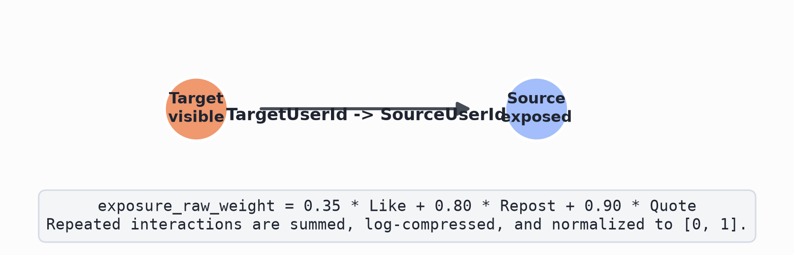
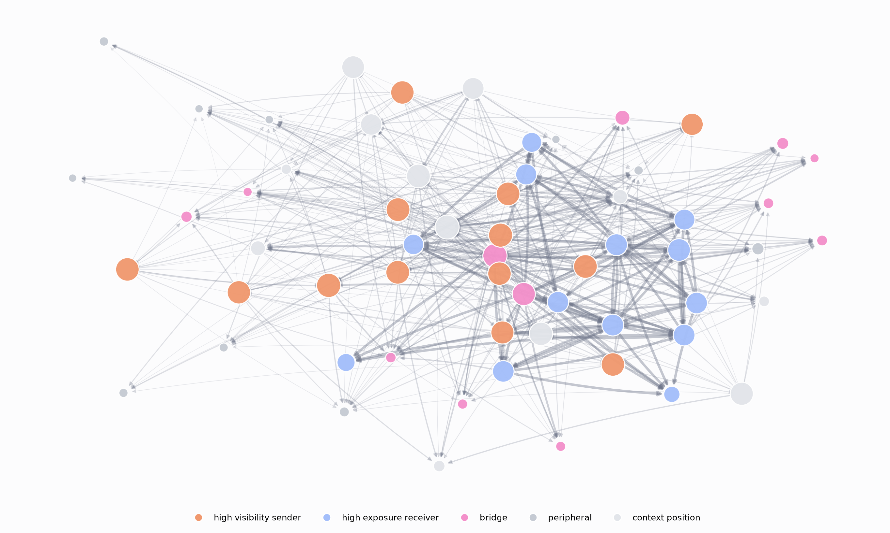
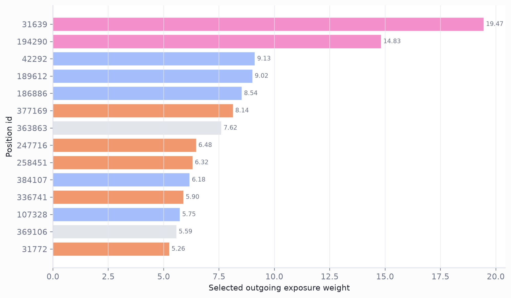
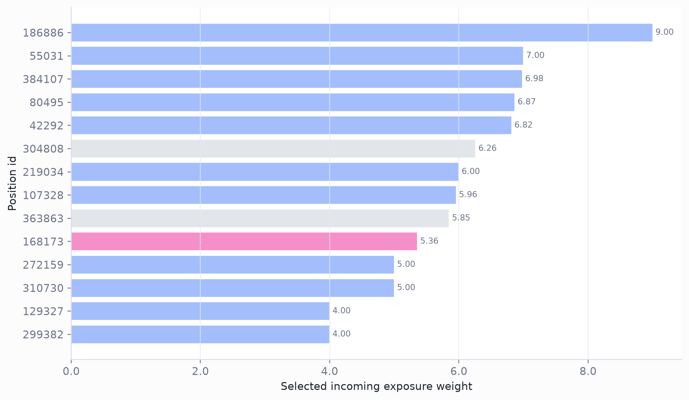
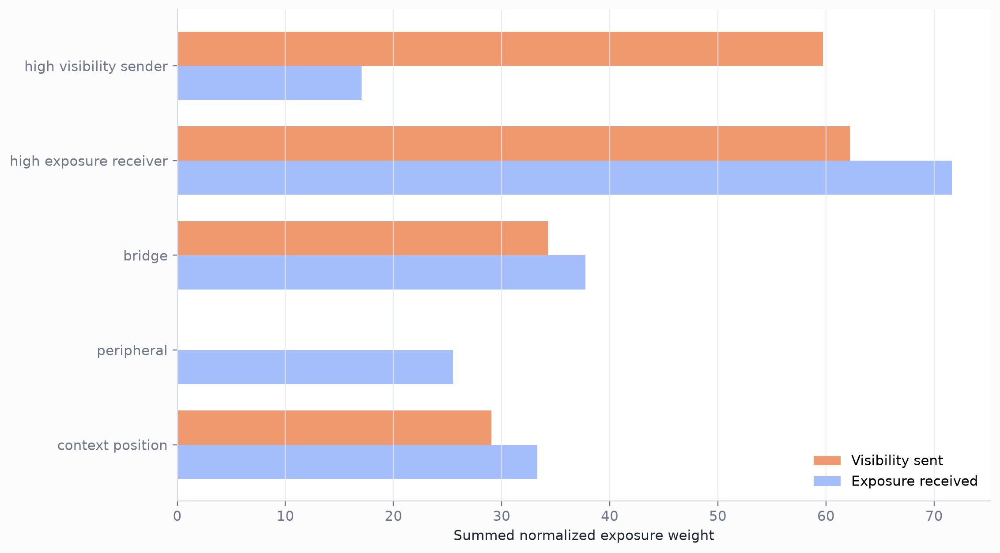

# Directed Exposure Network Substrate

## Technical Summary

This report isolates the empirical directed exposure-network substrate that will later be used to study network-conditioned cyber-manipulation effects. The first inspection window is the validated 60-position pilot slice, but the folder is structured to extend to the full PolitiSky24 exposure network.

- The pilot slice contains **60 positions** and **446 directed exposure edges**.
- The largest weak component contains **60 positions**, so the pilot slice is mostly connected while retaining peripheral positions.
- A node is an observed user position. A directed edge is a weighted plausible exposure relation from a visible target to the source user who engaged with that target.
- Edge direction is **TargetUserId -> SourceUserId**: the visible actor/content source points toward the user who engaged and was plausibly exposed.
- This is structural only. No profiles, opinions, attack vectors, baseline scores, post scores, or synthetic susceptibility values are used here.

## Exposure Definition And Edge Construction

The exposure graph is derived from observed engagement events. If a source user liked, reposted, or quoted a target user, the target user was plausibly visible to the source user.

```text
exposure_raw_weight = 0.35 * Like
                    + 0.80 * Repost
                    + 0.90 * Quote
```

Repeated interactions are summed, log-compressed, and normalized to `[0, 1]`. The local edge columns keep the same direction: `source_position_id` is the visible target; `target_position_id` is the exposed source.



## The 60-Position Pilot Slice As A Directed Exposure Map

The pilot slice is a readable window into the larger exposure network. In the figure, each node is a user position, each arrow is a directed exposure edge, node size follows full-network outgoing visibility, and edge width/opacity follows normalized exposure weight. Node identifiers are intentionally omitted from the figure to keep the map publication-ready.



The color legend uses interpretable exposure-mechanism roles:

| Role | Definition |
|---|---|
| high visibility sender | Positions selected because they rank high on full-network weighted out-degree, with eigenvector centrality as a tie-breaker. These positions represent actors whose content is plausibly visible to many others. |
| high exposure receiver | Positions selected because they rank high on full-network weighted in-degree, with eigenvector centrality as a tie-breaker. These positions represent actors with many incoming exposure sources. |
| bridge | Positions selected because they rank high on approximate betweenness and bridge score. These positions connect otherwise more separated parts of the directed exposure graph. |
| peripheral | Positions selected because both weighted out-degree and weighted in-degree are low while still satisfying the prompt-peer-capacity requirement. |
| context position | Remaining selected positions retained for community coverage and induced connectivity. They are shown as network context rather than interpreted as a mechanism class in this figure. |

## Sender Reach, Receiver Exposure, And Asymmetry

The same position can be a strong sender, strong receiver, both, or neither. This matters for later `PN` analysis because visible high-susceptibility senders can affect many downstream profiles, while exposed receivers define the local peer context each profile sees.





## Exposure Roles In The Pilot Slice

The role-level summary is included only to show how the interpretable mechanism classes differ in exposure sent and received. Positions outside the sender, receiver, bridge, and peripheral definitions are grouped as context positions; the two-dimensional layout should not be read as a literal community-core map.



## Interactive Sample-Size Explorer

The static 60-position map is the publication-ready snapshot. For structural inspection, the standalone interactive explorer expands one deterministic nested sample from 30 to 500 nodes. Increasing the sample size only adds nodes; it does not resample the already selected positions.

[Open the interactive exposure map](exposure_network_interactive.html)

## Full-Scale Multi-Resolution Explorer

The 30-500 node explorer is the readable microscope. The full-scale explorer extends the same empirical substrate from 500 positions to all observed PolitiSky24 positions. It uses adaptive node layouts up to 2,000 positions, then switches to a hierarchical macro-community view with community and ego drill-down.

[Open the multi-resolution exposure map](exposure_network_multiresolution.html)

## How This Expands To The Full Exposure Network

This report package reads the canonical graph substrate from `data/exposure_networks/politisky24_bluesky_v1/`. The current first report focuses on a derived 60-position pilot slice, while the same conventions can be extended to full-network community flow, propagation reach, profile-position assignment, and final outcome models over `B`, `BN`, `P`, and `PN`.

## Limitations

- Observed engagement is not a full Bluesky feed-ranking model.
- An edge implies plausible exposure, not confirmed reading or persuasion.
- The 60-position pilot slice is deliberately role-balanced, not a random population sample.
- This report prepares structural network covariates only; it does not estimate cyber-manipulation effects.
