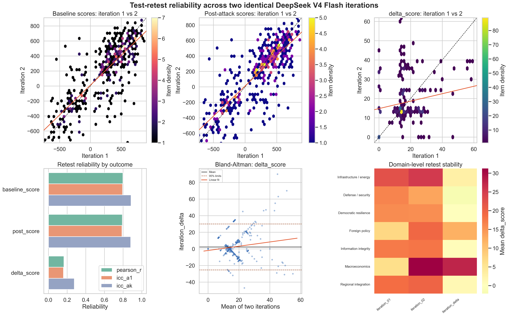
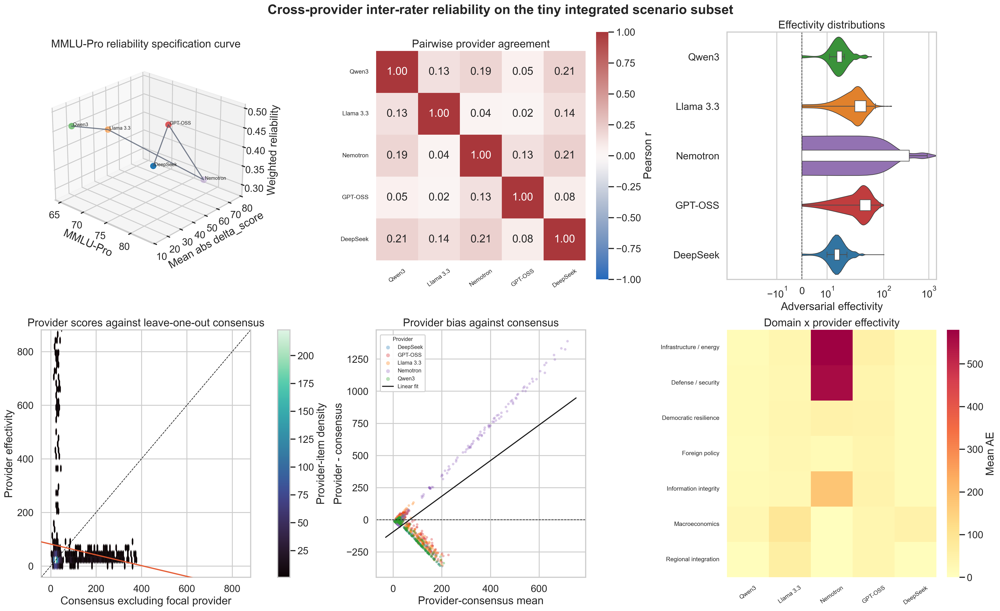
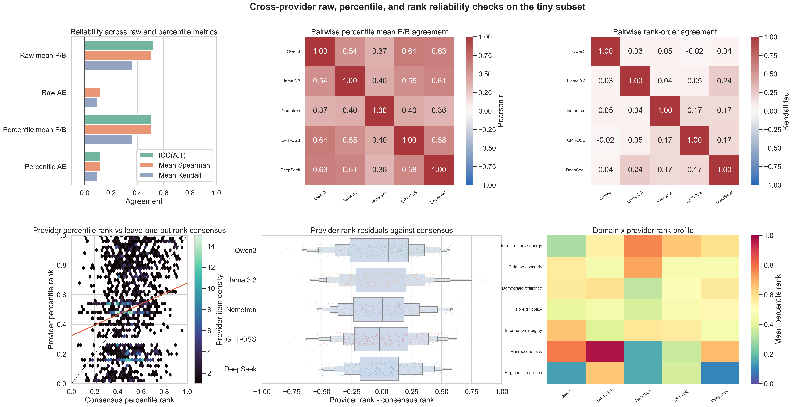
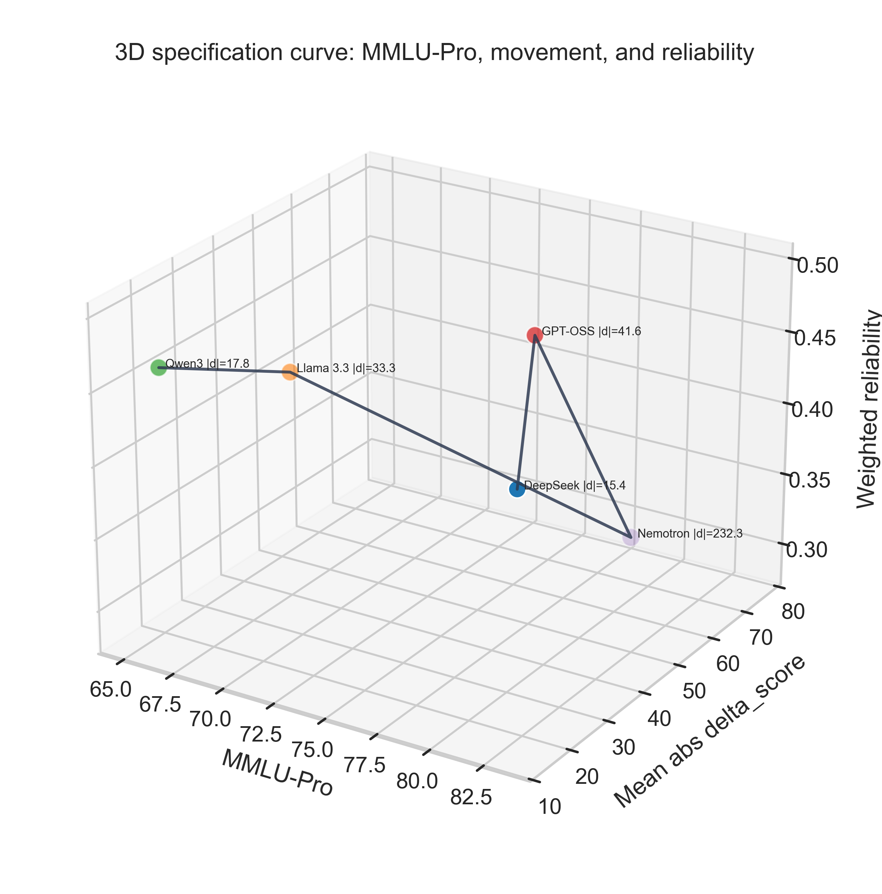

# Supplementary Analysis 01: Interreliability Checks

This directory contains two tiny, controlled reliability checks for the
integrated individual-layer opinion simulation. No git commit or push is
performed by these scripts.

## Design

The two supplementary panels are:

1. **Test-retest repeated-run reproducibility** across two independent runs of
   the same primary model (`deepseek/deepseek-v4-flash`) on the same 30
   integrated scenarios.
2. **Cross-provider inter-rater reliability** across five low-cost OpenRouter
   models on the same 20 integrated scenarios.

Scenarios are sampled from
`src/backend/pipeline/separate/01_create_scenarios/samples/02_integrated/integrated_scenarios_10000.jsonl`
with the existing Stage 01 integrated stratified-domain sampler. The
test-retest panel uses 30 scenarios; both iterations receive exactly the same
scenario IDs. The cross-provider panel uses 20 scenarios; each provider receives
exactly the same scenario IDs.

Each selected scenario is scored with the existing cluster-batched individual
layer:

- Stage 02: baseline opinion cluster assessment.
- Stage 03: deterministic DISARM Plan/Prepare/Execute attack-vector
  specification; zero LLM calls.
- Stage 04: post-attack opinion cluster assessment.
- Stage 05: expansion to per-leaf deltas and adversarial effectivity.

The nominal LLM call budgets are:

- Test-retest: `30 scenarios x 2 phases x 2 iterations = 120 calls`.
- Cross-provider: `20 scenarios x 2 phases x 5 providers = 200 calls`.

Repair retries can add calls only when a model returns invalid JSON. The run
status table records raw response file counts, token counts, cost, reasoning
tokens, and deterministic fallback counts.

## Controlled Parameters

The supplementary runner uses the same prompt files and schema validators as the
main project. Parameters are stored in `config/analysis_config.json`.

- `temperature = 0.15`
- `top_p = 1.0`
- `max_repair_iter = 2`
- `timeout_sec = 180`
- `max_concurrency = 4` unless overridden on the CLI
- `response_format = {"type": "json_object"}`
- cluster output token cap is deterministic by leaf count:
  `min(9000, max(1800, 900 + 420 * n_leaves))`
- self-supervised coherence rewrites disabled to keep the nominal call design
  fixed
- no exposure-network stages are run

Reasoning is controlled per route to preserve strict JSON behavior:

- DeepSeek V4 Flash, Qwen3-32B, and Nemotron 3 Nano: reasoning disabled and
  excluded.
- GPT-OSS 120B: reasoning is mandatory, constrained to a small reasoning-token
  budget and excluded from returned content.
- Llama 3.3 70B Instruct: no explicit reasoning control.

## Main Figures

### Test-retest reliability



Interpretation: baseline and post-attack scores are stable across repeated
runs, but `delta_score` is substantially less stable. This is a repeated-run
reproducibility check, not evidence of temporal drift.

### Cross-provider reliability



Interpretation: continuous cross-provider agreement is weak for `delta_score`.
Nemotron produces a much larger movement profile than the other providers,
which appears as a scale outlier in the distribution, consensus, and domain
panels.

### Cross-provider percentile and rank reliability



Interpretation: the four summary rows compare raw mean baseline/post scores,
raw `delta_score`, and their provider-wise percentile equivalents. Percentile
mean P/B agreement is higher than raw AE agreement, while AE rank-order
agreement remains weak. This separates general score-level comparability from
agreement about attack-induced movement.

### MMLU-Pro specification curve



Interpretation: the benchmark axis is consistently MMLU-Pro for all five
models. The movement axis is capped at `75`
for display, while raw values remain uncapped in the CSV files. The
non-Nemotron mean absolute `delta_score` range is `15.389`
to `41.630`, while Nemotron is
`232.318`. Weighted reliability is the equal-weight average
of provider-vs-consensus ICC(A,1) for baseline, post-attack, and `delta_score`.

## Current Results

Test-retest repeated-run `delta_score` reproducibility, where `delta_score`
is the de-duplicated adversarial-effectivity / absolute-delta outcome:
Pearson r = `0.166`, ICC(A,1) = `0.161`,
and mean `iteration_delta` = `2.311`.

Cross-provider continuous `delta_score` agreement remains low:
ICC(A,1) = `0.007` and ICC(A,k) =
`0.033`. Strongest pairwise provider correlation:
deepseek_v4_flash vs nemotron3_nano_30b (r=0.213). Weakest pairwise provider correlation: gpt_oss_120b vs llama33_70b (r=0.018).

Percentile and rank diagnostics are saved as a separate sensitivity analysis,
not as a replacement for the continuous result. Raw mean P/B ICC(A,1) =
`0.524`; raw AE ICC(A,1) = `0.007`;
percentile mean P/B ICC(A,1) = `0.510` with mean
pairwise Pearson r = `0.509`; percentile AE
ICC(A,1) = `0.121` with mean pairwise Spearman rho =
`0.121`. Raw AE mean pairwise Spearman rho =
`0.121` and mean Kendall tau =
`0.093`.

## Model Benchmark Metadata

MMLU-Pro values are stored in `config/models.json` and exported to
`05_tables/model_benchmark_metadata.csv`. Original MMLU is retained as metadata
when available, but the specification curve uses MMLU-Pro for every provider.
GPT-OSS uses the Vals AI MMLU-Pro value because the OpenAI model card reports
MMLU but not MMLU-Pro.

| display_name            | openrouter_model                  |   mmlu_pro_score | benchmark_type   |   mean_abs_delta_score |   weighted_reliability |   n_items |
|:------------------------|:----------------------------------|-----------------:|:-----------------|-----------------------:|-----------------------:|----------:|
| DeepSeek V4 Flash       | deepseek/deepseek-v4-flash        |           83.000 | MMLU-Pro         |                 15.389 |                  0.446 |       311 |
| GPT-OSS 120B            | openai/gpt-oss-120b               |           79.170 | MMLU-Pro         |                 41.630 |                  0.490 |       311 |
| Nemotron 3 Nano 30B-A3B | nvidia/nemotron-3-nano-30b-a3b    |           78.300 | MMLU-Pro         |                232.318 |                  0.291 |       311 |
| Llama 3.3 70B Instruct  | meta-llama/llama-3.3-70b-instruct |           68.900 | MMLU-Pro         |                 33.344 |                  0.444 |       311 |
| Qwen3 32B               | qwen/qwen3-32b                    |           65.540 | MMLU-Pro         |                 17.842 |                  0.460 |       311 |

Sources:

- DeepSeek V4 Flash: https://huggingface.co/deepseek-ai/DeepSeek-V4-Flash
- GPT-OSS 120B MMLU-Pro: https://www.vals.ai/comparison?modelA=fireworks%2Fgpt-oss-120b
- GPT-OSS 120B model card: https://arxiv.org/html/2508.10925v1
- Qwen3 32B: https://arxiv.org/html/2505.09388v1
- Nemotron 3 Nano 30B-A3B: https://build.nvidia.com/nvidia/nemotron-3-nano-30b-a3b/modelcard
- Llama 3.3 70B Instruct: https://github.com/meta-llama/llama-models/blob/main/models/llama3_3/MODEL_CARD.md

## File Layout

- `config/`: fixed model list, benchmark metadata, and run parameters.
- `scripts/supplementary_reliability.py`: end-to-end runner and analysis code.
- `01_inputs/`: sampled scenario IDs and Stage 01 scenario manifests.
- `02_runs/`: per-provider and per-iteration stage outputs plus raw LLM
  provenance.
- `03_metrics/`: combined long tables and reliability metrics.
- `05_tables/`: clean metadata tables for manuscript use.
- `04_images/`: PNG figures organized by analysis.

## Re-run

From the repository root:

```bash
python src/supplementaries/01_interreliability_checks/individual_layer/scripts/supplementary_reliability.py all
```

Useful narrower commands:

```bash
python src/supplementaries/01_interreliability_checks/individual_layer/scripts/supplementary_reliability.py prepare
python src/supplementaries/01_interreliability_checks/individual_layer/scripts/supplementary_reliability.py run --panel cross_provider
python src/supplementaries/01_interreliability_checks/individual_layer/scripts/supplementary_reliability.py run --panel test_retest
python src/supplementaries/01_interreliability_checks/individual_layer/scripts/supplementary_reliability.py analyze
```
