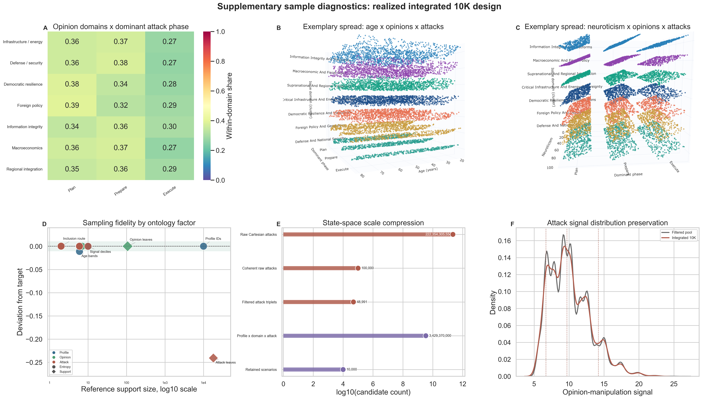
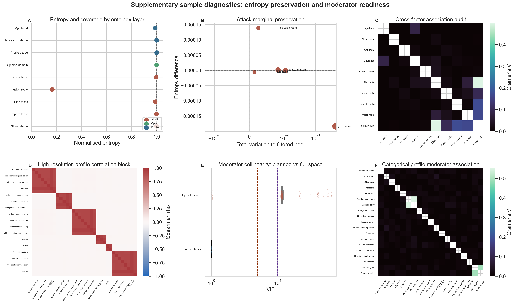

# Supplementary Analysis 02: Sample Diagnostics

This supplement audits the integrated 10,000-row scenario sample before any LLM
scoring. It focuses on realized design coverage, entropy preservation across the
profile, opinion, and attack ontologies, and whether profile moderator variables
are usable without hidden collinearity or confounding.

## Design

Each scenario combines one profile, one DISARM-red Plan/Prepare/Execute attack
triplet, and one opinion issue-domain cluster. The diagnostics use the existing
Stage 01 artifacts only. No model calls are made.

The two 3D source images in `images/3D_entropy_maximization/` are used as
exemplary spread panels inside Figure 1:

- `age_opinions_attacks.png`
- `neuroticism_opinions_attacks.png`

## Main Figures

### Figure 1. Realized Integrated 10K Design



Interpretation: the domain-by-phase panel checks whether the realized sample
keeps attack-phase composition balanced within each opinion domain. The age and
neuroticism panels then illustrate that profile variation is distributed across
opinion-domain strata and Plan/Prepare/Execute phases, rather than concentrated
in a narrow slice of the design. The sampling-fidelity panel places ontology
factors by reference support size and realized entropy or support deviation,
making the high-dimensional attack-leaf compression visible without conflating
it with failures of marginal balance. The scale panel documents the log10
compression from the large attack and scenario candidate spaces into the
retained 10K design, and the attack-signal panel shows close distributional
preservation relative to the filtered attack pool.

### Figure 2. Entropy Preservation and Moderator Readiness



Interpretation: profile and opinion entropy are at or near their theoretical
maximum, while attack marginals preserve the filtered DISARM-red pool rather
than imposing artificial uniformity. Cross-ontology Cramer's V remains very low,
which supports the independence of profile, opinion, and attack assignment.
The high-resolution profile space has strong structural collinearity, as
expected from facet and aggregate scores, but the planned moderator block has
VIF near 1.0.

## Key Results

- Scenarios: `10,000`.
- Unique profiles: `10,000` of `10,000`.
- Opinion domains: `7` of `7`.
- Directional opinion leaves covered: `106`.
- Filtered attack triplets sampled: `10,000` of `48,991`.
- Distinct filtered attack leaves covered: `75.9%`.
- Maximum cross-ontology Cramer's V: `0.032`.
- Maximum within-attack Cramer's V: `0.500`.
- Planned moderator maximum VIF: `1.003`.
- Full high-resolution profile median VIF: `11.72`.
- Full high-resolution profile maximum VIF: `67.37`.
- Maximum categorical profile Cramer's V: `0.553`.

## Outputs

- `images/01_sampling_design_diagnostics.png`
- `images/02_entropy_and_profile_moderator_diagnostics.png`
- `images/3D_entropy_maximization/age_opinions_attacks.png`
- `images/3D_entropy_maximization/neuroticism_opinions_attacks.png`
- `metrics/`
- `tables/sample_diagnostics_summary.csv`

## Re-run

```bash
python src/supplementaries/02_sample_diagnostics/scripts/sample_diagnostics.py
```
